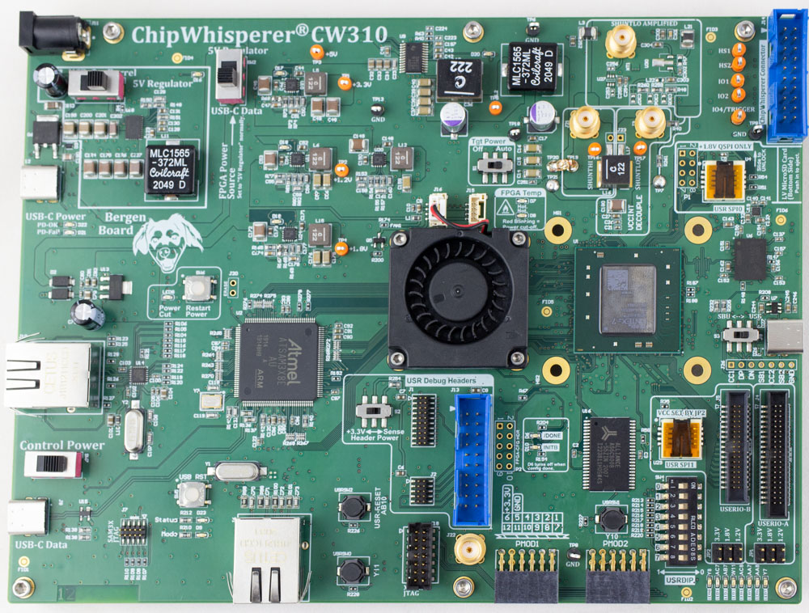

Do you want to try out the lowRISC chip designs, but don't have a couple thousand or million dollars ready for an ASIC tapeout?
Running lowRISC designs on an FPGA board can be the answer!

<!-- TODO: Switch all calls to fusesoc and the Verilated system to refer to Meson, once it supports fusesoc. -->

## Bergen Board for Existing OT Developers

**NB: You will need to get a Vivado 30-day trial license for the K410T device**. This must be done via the online Xilinx website (*not* via the license manager within Vivado). Using the online website will allow you to continue an evaluation by requesting a new evaluation license, as you may not be able to fully evaluate the power of Vivado within 30 days. The license manager within Vivado only allows a single license request.


### udev rule setup

Add the following to the `90-opentitan.rules` file in `/etc/udev/rules.d`

```
# ChipWhisperer Bergen Board
ACTION=="add|change", SUBSYSTEM=="usb|tty", ATTRS{idVendor}=="2b3e", ATTRS{idProduct}=="c310", MODE="0666"
```

And reload the rules with `udevadm control --reload-rules` .

### Bergen Loader

Unlike standard dev-boards, Bergen includes a programmable microcontroller that communicates with the target FPGA. This microcontroller is responsible for tasks including:

* Configuring/reconfiguring the FPGA.
* Monitor the FPGA temperature, controlling fans, shutting down power if entering over-temp situation.
* Adjusting the core voltage.
* Controlling the on-board PLL to set required clock frequency.
* Allowing power cycling of the FPGA target.
* USB-serial ports for communication.
* address/data bus which can be used as 30 computer-controller GPIO pins instead.
* Generic SPI interface.

A simplified shim program called `bergenloader.py` provides the most likely required features: (1) configuring/reconfiguring the FPGA, and (2) loading software onto the opentitan core using the existing JTAG/SPI interface.

```console
./util/bergenloader.py -bs build/lowrisc_systems_top_earlgrey_bergen-k410t_0.1/synth-vivado/lowrisc_systems_top_earlgrey_bergen-k410t_0.1.bit
```

This will take 5-20 seconds to execute. After, you can simply load software images as such:

```console
./util/bergenloader.py -fw build-bin/sw/device/examples/hello_world/hello_world_fpga_nexysvideo.bin
```

These commands can be combined to run together, in which case the FPGA is always configured first.

### Serial Port Connection

The Bergen Board provides two serial ports for your use. They will normally enumerate as `/dev/ttyACM0` and `/dev/ttyACM1`, although you can check dmesg when plugging in.

In this scenario, the default OpenTitan port is connected to `/dev/ttyACM1`. Be sure to specify no xon/xoff control for this port to work with screen using `-ixon` and `-ixoff`, the suggested connect script is:

```console
screen /dev/ttyACM1 115200,8n1,-ixon,-ixoff
```

A lazy script is provided at `./util/bergen-serial.sh` which runs this command.