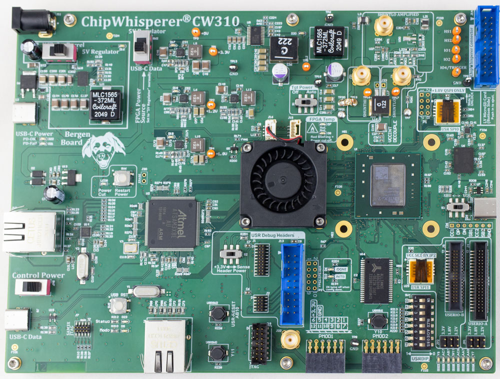

Do you want to try out the lowRISC chip designs, but don't have a couple thousand or million dollars ready for an ASIC tapeout?
Running lowRISC designs on an FPGA board can be the answer!

<!-- TODO: Switch all calls to fusesoc and the Verilated system to refer to Meson, once it supports fusesoc. -->

## Newbie Guide

The following assumes you have limited experience with OpenTitan.

### Prerequisites

To use the lowRISC Comportable designs on an FPGA you need two things:

* A supported FPGA board (here the Bergen Board)
* A tool from the FPGA vendor

Follow the install instructions to [prepare the system]() and to install the [software development tools]() and [Xilinx Vivado]().

**NB: You will need to get a Vivado 30-day trial license for the K410T device**.

### Create an FPGA bitstream

Synthesizing a design for a FPGA board is done with the following commands.

The FPGA build will pull in a program to act as the boot ROM.
This must be built before running the FPGA build.
This is pulled in from the `sw/device/boot_rom` directory (see the `parameters:` section of the `hw/top_earlgrey/top_earlgrey_nexysvideo.core` file).

To build it:
```console
$ cd $REPO_TOP
$ ./meson_init.sh
$ ninja -C build-out all
```

Since not all FPGAs are able to fit the full design, there is a separate script that can be invoked to reduce the size of the design.

To reduce the design such that it fits the Nexys Video FPGA board:
```console
$ cd $REPO_TOP
$ ./hw/top_earlgrey/util/top_earlgrey_reduce.py --build
```
The `--build` argument is optional and ensures that the boot ROM is rebuilt for the reduced design.
Alternatively, the boot ROM can be manually regenerated using the previous command.


In the following example we synthesize the Earl Grey design for the Bergen Board with a K410T FPGA (the larger option) using Xilinx Vivado 2020.1.

```console
$ . /tools/xilinx/Vivado/2020.1/settings64.sh
$ cd $REPO_TOP
$ ./meson_init.sh
$ ninja -C build-out all
$ fusesoc --cores-root . run --flag=fileset_top --target=synth lowrisc:systems:top_earlgrey_bergen-k410t
```
The `fileset_top` flag used above is specific to the OpenTitan project to select the correct fileset.

The resulting bitstream is located at `build/lowrisc_systems_top_earlgrey_bergen_0.1/synth-vivado/lowrisc_systems_top_earlgrey_bergen_0.1.bit`.
See the [reference manual]() for more information.

### Connecting the board

* Use a Micro USB cable to connect the PC with the *PROG*-labeled connector on the board.
* Use a second Micro USB cable to connect the PC with the *UART*-labled connector on the board.
* After connecting the UART, use `dmesg` to determine which serial port was assigned. It should be named `/dev/ttyUSB*`, e.g. `/dev/ttyUSB0`.
* Ensure that you have sufficient access permissions to the device, check `ls -l /dev/ttyUSB*`. The udev rules given in the Vivado installation instructions ensure this.

### Flash the bitstream onto the FPGA

To flash the bitstream onto the FPGA you need to use either the Vivado GUI or the command line.

#### Using the command line

Use the following command to program the FPGA with fusesoc.

```console
$ . /tools/xilinx/Vivado/2020.1/settings64.sh
$ cd $REPO_TOP
$ fusesoc --cores-root . pgm lowrisc:systems:top_earlgrey_nexysvideo:0.1
```

This should produce a message like this from the UART:

```
Version:    opentitan-snapshot-20191101-1-366-gca61d28
Build Date: 2019-12-13, 13:15:48
Bootstrap requested, initialising HW...
HW initialisation completed, waiting for SPI input...
```

Note: `fusesoc pgm` is broken for edalize versions up to (and including) v0.1.3.
You can check the version you're using with `pip3 show edalize`.
If you have having trouble with programming using the command line, try the GUI.

#### Using the Vivado GUI

```console
$ . /tools/xilinx/Vivado/2020.1/settings64.sh
$ cd $REPO_TOP
$ make -C build/lowrisc_systems_top_earlgrey_nexysvideo_0.1/synth-vivado build-gui
```

Now the Vivado GUI opens and loads the project.

* Connect the FPGA board to the PC and turn it on.
* In the navigation on the left, click on *PROGRAM AND DEBUG* > *Open Hardware Manager* > *Open Target* > *Auto Connect*.
* Vivado now enumerates all boards and connects to it.
* Click on *Program Device* in the menu on the left (or at the top of the screen).
* A dialog titled *Program Device* pops up. Select the file `lowrisc_systems_top_earlgrey_nexysvideo_0.1.bit` as *Bitstream file*, and leave the *Debug probes file* empty.
* Click on *Program* to flash the FPGA with the bitstream.
* The FPGA is ready as soon as the programming finishes.


### Testing the demo design

The `hello_world` demo software shows off some capabilities of the design.
In order to load `hello_world` into the FPGA, both the binary and the [loading tool]() must be compiled.
Please follow the steps shown below.

* Generate the bitstream and flash it to the FPGA as described above.
* Open a serial console (use the device file determined before) and connect.
  Settings: 115200 baud, 8N1, no hardware or software flow control.
  ```console
  $ screen /dev/ttyUSB0 115200
  ```
  Note that the Nexsys Video demo program that comes installed on the board runs the UART at 115200 baud as well;
  expect to see different output if that is running.
  This can happen if you connect the serial console before using Vivado to program your new bitstream or you press the *PROG* button that causes the FPGA to reprogram from the code in the on-board SPI flash.
* On the Nexys Video board, press the red button labeled *CPU_RESET*.
* You should see the ROM code report its commit ID and build date.
* Run the loading tool.
  ```console
  $ cd ${REPO_TOP}
  $ ./meson_init.sh
  $ ninja -C build-out sw/device/examples/hello_world/hello_world_export_fpga_nexysvideo
  $ ninja -C build-out sw/host/spiflash/spiflash_export
  $ build-bin/sw/host/spiflash/spiflash --input build-bin/sw/device/examples/hello_world/hello_world_fpga_nexysvideo.bin
  ```

  which should report how the binary is split into frames:

  ```
   Running SPI flash update.
   Image divided into 6 frames.
   frame: 0x00000000 to offset: 0x00000000
   frame: 0x00000001 to offset: 0x000003d8
   frame: 0x00000002 to offset: 0x000007b0
   frame: 0x00000003 to offset: 0x00000b88
   frame: 0x00000004 to offset: 0x00000f60
   frame: 0x80000005 to offset: 0x00001338
   ```

  and then output like this should appear from the UART:
  ```
  Processing frame no: 00000000 exp no: 00000000
  Processing frame no: 00000001 exp no: 00000001
  Processing frame no: 00000002 exp no: 00000002
  Processing frame no: 00000003 exp no: 00000003
  Processing frame no: 00000004 exp no: 00000004
  Processing frame no: 80000005 exp no: 00000005
  bootstrap: DONE!
  INFO: Boot ROM initialisation has completed, jump into flash!
  Hello World! Dec 13 2019 15:06:29
  Watch the LEDs!
  Try out the switches on the board
  or type anything into the console window.
  The LEDs show the ASCII code of the last character.
  GPIO: Switch 7 changed to 1
  FTDI control changed. Enable JTAG
  ```

* Observe the output both on the board and the serial console. Type any text into the console window.
* Exit `screen` by pressing CTRL-a k, and confirm with y.

## Develop with the Vivado GUI

Sometimes it is helpful to use the Vivado GUI to debug a design.
fusesoc makes that easy, with one small caveat: by default fusesoc copies all source files into a staging directory before the synthesis process starts.
This behavior is helpful to create reproducible builds and avoids Vivado modifying checked-in source files.
But during debugging this behavior is not helpful.
The `--no-export` option of fusesoc disables copying the source files into the staging area, and `--setup` instructs fusesoc to only create a project file, but not to run the synthesis process.

```console
$ # only create Vivado project file
$ fusesoc --cores-root . build --no-export --setup lowrisc:systems:top_earlgrey_nexysvideo
```

## Expert Guide

Do you already breath OpenTitan? This section of the guide will cover the specific features & changes important for the Bergen Board.

### udev rule setup

Add the following to the `90-opentitan.rules` file in `/etc/udev/rules.d`

```
# ChipWhisperer Bergen Board
ACTION=="add|change", SUBSYSTEM=="usb|tty", ATTRS{idVendor}=="2b3e", ATTRS{idProduct}=="c310", MODE="0666"
```

And reload the rules with `udevadm control --reload-rules` .

### Bergen Loader

Unlike standard dev-boards, Bergen includes a programmable microcontroller that communicates with the target FPGA. This microcontroller is responsible for tasks including:

* Configuring/reconfiguring the FPGA.
* Monitor the FPGA temperature, controlling fans, shutting down power if entering over-temp situation.
* Adjusting the core voltage.
* Controlling the on-board PLL to set required clock frequency.
* Allowing power cycling of the FPGA target.
* USB-serial ports for communication.
* address/data bus which can be used as 30 computer-controller GPIO pins instead.
* Generic SPI interface.

A simplified shim program called `bergenloader.py` provides the most likely required features: (1) configuring/reconfiguring the FPGA, and (2) loading software onto the opentitan core using the existing JTAG/SPI interface.

```console
./util/bergenloader.py -bs build/lowrisc_systems_top_earlgrey_bergen-k410t_0.1/synth-vivado/lowrisc_systems_top_earlgrey_bergen-k410t_0.1.bit
```

This will take 5-20 seconds to execute. After, you can simply load software images as such:

```console
./util/bergenloader.py -fw build-bin/sw/device/examples/hello_world/hello_world_fpga_nexysvideo.bin
```

These commands can be combined to run together, in which case the FPGA is always configured first.

### Serial Port Connection

The Bergen Board provides two serial ports for your use. They will normally enumerate as `/dev/ttyACM0` and `/dev/ttyACM1`, although you can check dmesg when plugging in.

In this scenario, the default OpenTitan port is connected to `/dev/ttyACM1`. Be sure to specify no xon/xoff control for this port to work with screen using `-ixon` and `-ixoff`, the suggested connect script is:

```console
screen /dev/ttyACM1 115200,8n1,-ixon,-ixoff
```

A lazy script is provided at `./util/bergen-serial.sh` which runs this command.